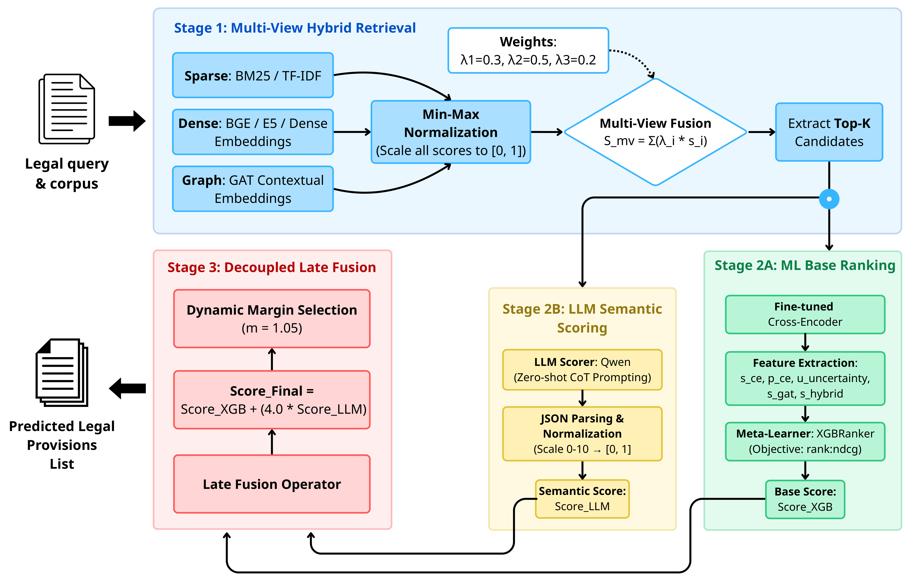

# ViMELD: Vietnamese Multi-view Enhanced Legal Decoupling Framework for Legal Document Retrieval

Official implementation of:

**ViMELD: Vietnamese Multi-view Enhanced Legal Decoupling Framework for Legal Document Retrieval**

<p align="center">
  
</p>

---

---

## Overview

Vietnamese Legal Information Retrieval (LIR) is challenging due to:

- Implicit legal semantics.
- Dense cross-references among legal articles.
- Multi-label retrieval requirements.
- Limitations of Large Language Models (LLMs) when used directly as judges.

ViMELD proposes a three-stage retrieval framework:

1. Multi-View Hybrid Retrieval
2. Uncertainty-Aware Meta-Learner
3. Decoupled Late Fusion with LLM Scoring

The framework combines sparse retrieval, dense retrieval, graph-based structural retrieval, machine learning ranking, and LLM-based semantic scoring.

---

## Architecture

### Phase 1: Multi-View Hybrid Retrieval

Three complementary retrieval signals are combined:

- Sparse Retrieval (BM25L)
- Dense Retrieval (Vietnamese Embedding Model)
- Graph-based Retrieval (Graph Attention Network)

The legal corpus is represented as a citation graph where:

- Nodes = legal articles
- Edges = article citations and hierarchical relations

The three retrieval scores are normalized and fused:

```
S_mv = λ1·S_sparse + λ2·S_dense + λ3·S_gat
```

Best-performing configuration reported in the paper:

```
λ1 = 0.3
λ2 = 0.5
λ3 = 0.2
```

Reported Recall@30:

```
0.9765
```

---

### Phase 2: Uncertainty-Aware Meta-Learner

Top retrieval candidates are re-ranked using XGBoost.

Feature set includes:

- Hybrid retrieval score
- Cross-Encoder score
- Cross-Encoder confidence
- Query uncertainty estimate
- Graph structural score

The final candidate set is selected using an empirical margin strategy.

---

### Phase 3: Decoupled Late Fusion

Qwen3-8B-Instruct is used as an independent semantic scorer.

Instead of directly deciding relevance, the LLM provides an auxiliary semantic score.

Final score:

```
Score_final = Score_XGB + w · Score_LLM
```

Reported fusion weight:

```
w = 4.0
```

This design avoids:

- Early-fusion data shift
- LLM over-reasoning
- Hard-veto filtering errors

---

## Dataset

Experiments were conducted on the ALQAC legal retrieval benchmark.

Official dataset:

https://huggingface.co/datasets/nguyenlab/ALQAC

According to the paper:

- 28 Vietnamese legal documents
- 724 legal articles
- 729 public training queries
- 82 private evaluation queries

Each query may correspond to one or more relevant legal provisions.

---

## Experimental Setup

### Retrieval

- BM25L
- AITeamVN/Vietnamese_Embedding_v2
- 2-layer Graph Attention Network

### Meta-Ranking

- XGBoost
- Fine-tuned bge-reranker-v2-m3 Cross-Encoder

### LLM Scoring

- Qwen3-8B-Instruct
- vLLM inference
- Temperature = 0.0

### Hardware

Reported in the paper:

- NVIDIA A100 80GB
- AMD EPYC 7742 CPU

---

## Main Results

### Retrieval Ablation

| Configuration | Recall@30 |
|--------------|-----------|
| Sparse Only | 0.9024 |
| Dense Only | 0.9756 |
| Sparse + Dense | 0.9634 |
| Multi-View GAT | 0.9765 |

### Meta-Learner Feature Ablation

| Removed Feature | F2-Macro |
|----------------|-----------|
| Cross-Encoder Score | 0.8485 |
| Hybrid Retrieval Score | 0.8488 |
| Uncertainty Feature | 0.8640 |
| Graph Score | 0.8699 |
| Full Feature Set | 0.8773 |

### LLM Integration Strategies

| Strategy | F2-Macro |
|-----------|-----------|
| Early Fusion | 0.5551 |
| LLM Direct Judge | 0.8238 |
| Hard Veto | 0.7872 |
| Decoupled Late Fusion | 0.8996 |

Final reported performance:

```
F2-Macro = 0.8996
```

---

## Repository Structure

```text
.
├── data/
├── scripts/
├── src/
├── experiments/
├── assets/
└── README.md
```

Adjust paths according to your local implementation.

---

## Installation

```bash
git clone https://github.com/lee-vtruong/legal-retrieval-project.git

cd legal-retrieval-project

pip install -r requirements.txt
```

---

## Citation

```bibtex
@article{vimeld2026,
  title={ViMELD: Vietnamese Multi-view Enhanced Legal Decoupling Framework for Legal Document Retrieval},
  author={Anonymous},
  year={2026}
}
```

Update citation information after publication.

---

## Acknowledgment

The paper acknowledges support from:

- Faculty of Information Technology
- University of Science, VNU-HCM

for providing the academic environment and computational resources used in this research.

---

## License

Specify an appropriate open-source license before release.
